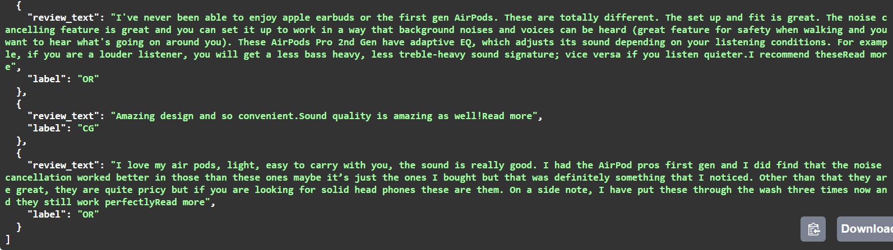

# Amazon Product Review Authenticator



## Overview

The Amazon Product Review Authenticator Classifier is a machine learning model and web application that scrapes reviews and other relevant information of an Amazon product and classifies the reviews as either Authentic (Original) or Fake (Computer Generated).

## Features

- **Review Scraping**: Utilizes web scraping techniques to extract reviews and other relevant information of an Amazon product.
- **Review Classification**: Classifies the reviews as either Authentic or Fake using a trained Naive Bayes classifier.
- **FastAPI Integration**: Provides a web API for inputting a product URL and receiving individual reviews along with their labels.

## Dataset

- **Original Dataset**: The original dataset provided by the client for training the classifier did not include labels for Authentic or Fake reviews. It can be found [here](https://www.kaggle.com/datasets/shivamparab/amazon-electronics-reviews).
- **Additional Dataset**: An additional dataset with labels for Authentic and Fake reviews was used to train a separate Naive Bayes model for labeling the original dataset. It can be found [here](https://www.kaggle.com/datasets/mexwell/fake-reviews-dataset/data).

## Model Training

- **Labeller Notebook**: The `Naive_Bayes_Labeller.ipynb` notebook contains the code for training a Naive Bayes model to label the original dataset.
- **Final Model Notebook**: The `code.ipynb` notebook contains the code for training the final Naive Bayes model.

## Model Files

- **Final Model**: The trained Naive Bayes model is saved as `Final_Naive_Bayes.pkl`.
- **Vectorizer**: The Count Vectorizer used for vectorizing text data is saved as `Final_Count_Vectorizer.pkl`.

## Scripts

- **Scraping Script**: The `scrap.py` script includes functions to scrape information for each product from Amazon.
- **Preprocessing Helpers**: The `helpers.py` script includes functions for preprocessing input data before feeding it to the model.

## Web Application

- **API Endpoint**: The `app.py` script utilizes FastAPI to create an API endpoint that accepts a product URL as input and returns individual reviews along with their labels.

## Installation and Usage

1. Clone the repository:

    ```bash
    git clone https://github.com/mominwaqas15/Amazon-Reviews-Authenticator.git
    ```

2. Install the required dependencies:

    ```bash
    pip install -r requirements.txt
    ```
    
3. Move the model files (`Final_Naive_Bayes.pkl` and `Final_Count_Vectorizer.pkl`), along with the scripts (`scrap.py`, `helpers.py`, and `init.py`), into a folder.

4. Navigate to the folder containing the scripts and model files in your terminal.

5. Run the init.py script:

    ```bash
    python init.py
    ```

6. Access the API endpoint at `http://localhost:8000/docs`.

## Contributors

- **Moazzam Umer Gondal**
  - Email: moazzamumar22@gmail.com
  - GitHub: [@MoazzamGondal1](https://github.com/MoazzamGondal1)

## License

This project is licensed under the MIT License - see the [LICENSE](LICENSE) file for details.


## Contributing

Contributions are welcome! Feel free to open an issue or submit a pull request.
